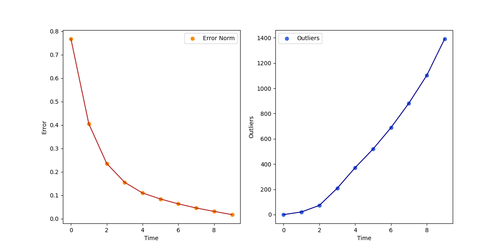

# Tricycle Robot Calibration

## Overview

This project aims to calibrate both the kinematic parameters and the sensor mounting position of a tricycle robot using real experimental data. A deep explanation can be found [here](https://eugeniobugli.github.io/TricycleRobot-Calibration/).

## Dataset

The dataset consists of **2434 samples**. Each sample includes:
- Time stamps
- Encoder readings for steering and traction wheels
- The robot’s global pose
- The sensor’s global pose

These poses are visualized below:

## Methodology

The tricycle is modeled as a FWD bicycle system.  
The calibration focuses on:
- The kinematic parameters
- Sensor pose relative to the robot

The approach uses an iterative least squares algorithm to find the best-fit parameters by minimizing the discrepancy between the measured and predicted sensor movement.

## Results

- The **error** (difference between predicted and measured movement) quickly decreases as the algorithm progresses.
- The number of identified outliers increases during optimization.

- After calibration, the **sensor’s measured trajectory** (blue) and the **calibrated prediction** (green) become much more aligned, indicating successful parameter estimation.

---

**Note:**  
Perfect overlap is not expected due to real-world noise and numerical approximations, but the improvement is clear after calibration.

---
